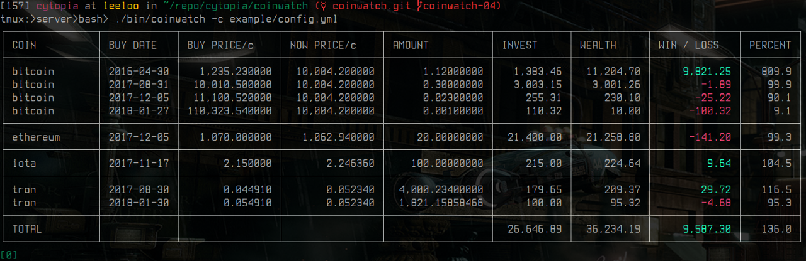
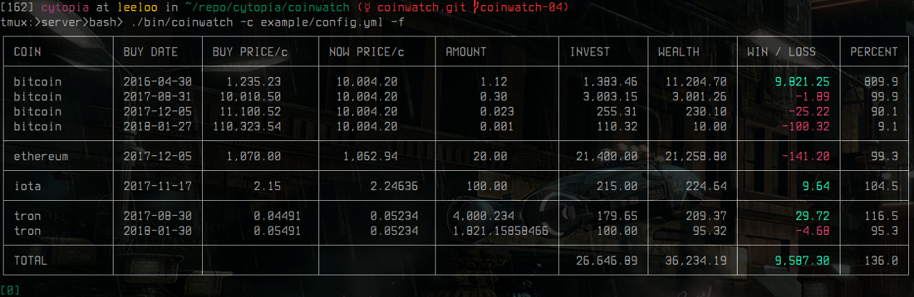
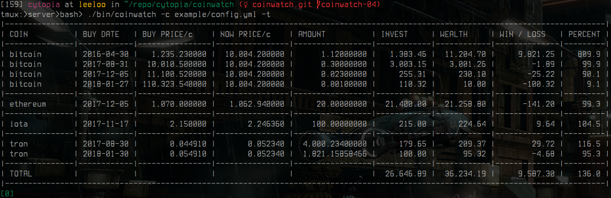
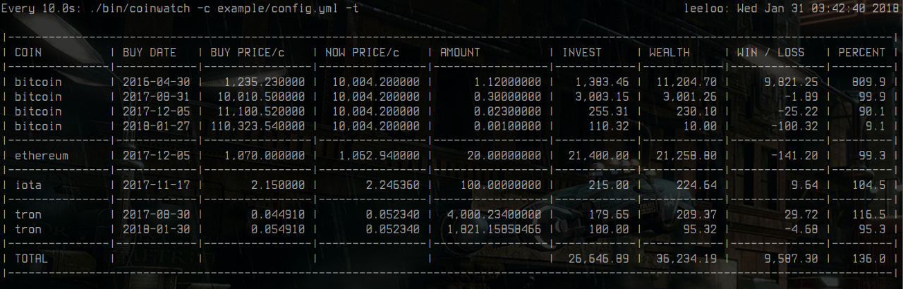
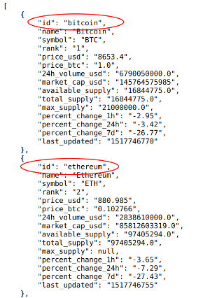

# coinwatch

**[Usage](#usage)** |
**[Screenshots](#screenshots)** |
**[Features](#features)** |
**[Columns](#columns)** |
**[Configuration](#configuration)** |
**[Options](#options)** |
**[API](#api)** |
**[Requirements](#requirements)** |
**[License](#license)**


[](https://github.com/psf/black)
[](https://pypi.org/project/coinwatch/)
[](https://pypi.org/project/coinwatch/)
[](https://pypi.org/project/coinwatch/)
[](https://pypi.org/project/coinwatch/)
[](https://pypi.org/project/coinwatch/)

[](https://travis-ci.org/cytopia/coinwatch)
[](https://github.com/cytopia/coinwatch/actions?workflow=linting)
[](https://github.com/cytopia/coinwatch/actions?workflow=testing)


Coinwatch is a low-dependency python-based console client client to keep track of your crypto trades and easily let's you see if you are winning or losing.

All you have to do is enter all of your purchases: **When**, **How many** coins and **price per coin**. Then each time you launch `coinwatch`, it will show your current status and will make you happy or sad.


## Usage
```bash
# Default run
coinwatch

# Specify different profile/config
coinwatch -c ~/path/to/conf.yml

# Different columns and order
coinwatch -r "name buyprice nowprice wealth invest profit"
coinwatch -r "name date nowprice wealth profit percent"

# Specify sort and order
coinwatch -s profit -o desc

# Sort and group by name
coinwatch -s name -g name

# Disable colorized output
coinwatch -n

# Different table border
coinwatch -t ascii
coinwatch -t thin
coinwatch -t thick

# Alternative number format
coinwatch -h

# Text output wrapped in watch
watch --interval=10 'coinwatch -n'
```


## Screenshots

The example shows the usage of an alternative configuration file.


The example shows an alternative number format


The example shows how it looks in text mode


The example shows coinwatch wrapped into `watch` and refresh every 10 seconds.



## Features

* Keep track of all of your trades
* Trades are grouped by each crypto currency
* Different trading profiles can be used by specifying different configuration files
* Pure text-based output is available for further processing in other tools


## Columns

`coinwatch` offers many columns that can be displayed in any order. A sane limited default is set in the configuration file which does not display all columns. You are free to alter that and adjust `coinwatch` to your needs directly in the configuration file (see **[Configuration](#configuration)**) or quickly enabled/disable columns via command arguments (`-r`). Sorting, ordering and grouping will also work on columns that are not being displayed. Have a look at the following table which shows you all available columns:

| Column name | Default display | Description |
|-------------|-----------------|-------------|
| `name`      | no              | Name of the cryptocurrency. |
| `symbol`    | yes             | Abbreviation name of the cryptocurrency. |
| `buyprice`  | yes             | Price in USD at which the currency was bought. |
| `diffprice` | yes             | Price difference in USD between buy time and now. |
| `nowprice`  | yes             | Current price in USD of the currency. |
| `amount`    | yes             | Total number of coins you have bought. |
| `invest`    | yes             | Total amount in USD you have invested for all coins bought. |
| `wealth`    | yes             | Current amount in USD your coins are worth now. |
| `profit`    | yes             | How much profit in USD did you make on that currency. |
| `percent`   | yes             | Percent of profit between buy time and now. |
| `percent1h` | no              | Percent of price change in the last hour of that currency. |
| `percent24h`| no              | Percent of price change in the last 24 hours of that currency. |
| `percent7d` | no              | Percent of price change in the last 7 days of that currency. |
| `vol_24h`   | no              | Volume in USD in the last 24 hours. |
| `marketcap` | no              | Market capacity in USD.
| `supply_a`  | no              | Currently available supply of coins. |
| `supply_t`  | no              | Total supply of coins. |
| `supply_m`  | no              | Maximum supply of coins. |
| `cust1`     | no              | Custom field (see **[Configuration](#configuration)**)|
| `cust2`     | no              | Custom field (see **[Configuration](#configuration)**)|
| `cust3`     | no              | Custom field (see **[Configuration](#configuration)**)|

**Note about custom fields:**

Headline and column width of custom fields can be set in the configuration file. The values itself can be added to your trade array and can contain any information you wish to display for a given trade. As an example they could contain information such as:
* At what date did you buy that currency
* At what market did you buy that currency
* The wallet address where the coins are
* Are the coins still online or already downloaded to a cold wallet


## Configuration
When starting `coinwatch` for the first time, it will create a default configuration file in `~/.config/coinwatch/config.yml` with no trades to watch. To get a quick overview, have a look at the [example config](example/config.yml).

Configuration is done in yaml format. If you have never heard about yaml before, have a look at its official example: http://yaml.org/start.html

### Structure
The configuration file is build up like this:
```yml
# Configure coinwatch
config:
  # Specify the default column to sort this table by or leave empty for unsorted.
  # Overwrite via -s <column>
  sort:
  # Specify the sort order (asc or desc)
  # Overwrite via -o desc
  order: asc
  # Configure what columns to display and in what order.
  # To see all available columns view help: $ coinwatch --help
  # Columns specified via command line (-r) take precedence
  #
  # There are also three other columns which are off by default: 'cust1', 'cust2' and 'cust3'.
  # Enable them here or via (-r).
  # Those three columns can be added to your trades in order to display custom information,
  # such as which market they were bought from or on what date they were bought.
  columns: name symbol date buyprice diffprice nowprice amount invest wealth profit percent
  # Define your custom columns here.
  # Set column headline and width.
  cust:
    cust1:
      headline: BUY DATE
      width: 10
    cust2:
      headline: MARKET
      width: 10
    cust3:
      headline: EXAMPLE
      width: 10
  # Specify your table border style
  # Available values: thin, thick and ascii
  # Use ascii if you want to further process the output of this application
  table: thin

# Configure your purchases
trades:
  # CURRENCY_ID is found by looking up the 'id' key from
  # https://api.coinmarketcap.com/v1/ticker/?limit=0
  CURRENCY_ID:  # <-- [array]       Each currency will hold a list of trades
    - amount:   # <-- [decimal]     [1] How many coins for that currency were bought
      invest:   # <-- [decimal]     [1] How much money in total was invested
      price:    # <-- [decimal]     [1] Price for 1 coin of that currency
      cust1:    # <-- [string]      Custom column
      cust2:    # <-- [string]      Custom column
      cust3:    # <-- [string]      Custom column
```

**`[1]`** `amount`, `invest` and `price` at the same time? Yes that's right there is duplication, however only always two of those three can be specified at the same time. This gives the possibility to record you trades in three different ways:

#### Option-1: amount and invest
How many coins did you buy and how much money in total did you spent on that?

This option is most useful when having done a real purchase. Enter the total money spent and the coins received. That way you don't have to calculate any market fees or transaction fees yourself.
```yml
# Bought 0.4 coins
# Total cost of that: 3742.35 $
trades:
  bitcoin:
    - amount: 0.4
      invest: 3742.35
```
#### Option-2: amount and price
How many coins did you buy and how much did one coin cost?

This option is most useful when doint dry-run trades - *What would have happened if*. Enter how many coins you had bought at what price per coin.
```yml
# Bought 0.4 coins
# 1 Bitcoin had a price of: 9355.875 $
trades:
  bitcoin:
    - amount: 0.4
      price:  9355.875
```
#### Option-3: invest and price
How much money in total did you spend and how much did one coin cost?

This option is most useful when doint dry-run trades - *What would have happened if*. Enter how much money you would have spent and what the price per coin was.
```yml
# Total cost of that: 3742.35 $
# 1 Bitcoin had a price of: 9355.875 $
trades:
  bitcoin:
    - invest: 3742.35
      price:  9355.875
```

### Get currency names

When adding new cryptocurrencies, you need to make sure that you use the correct name to add to the configuration file. Names can be retrieved from https://api.coinmarketcap.com/v1/ticker/?limit=0.

| Screenshot | Explanation |
|------------|-------------|
|  | When visiting the coinmarketcap API page, look for the `id` field of a currency and use its value to add to the configuration file.<br/><br/>In case you wanted to add Ethereum and Bitcoin as seen in the example screenshot, you would use `ethereum` and `bitcoin` as names to put into your configuration file. |


### Example
An example file could look like this. It shows three bitcoin trades (with each different option to specify your purchases), one ethereum trade and an empty place holder for iota. When specifying an empty array, it serves only as a reminder for you to fill that out later and will not be shown in the stats.

Additionally two custom fields have been configured to add more information to each trade. It is used to display the buy date as well as the market where it was bought from. Then in order to actually show those columns, the `columns` configuration has been changed to also add these two fields.
```yml
config:
  columns: name symbol cust1 cust2 buyprice diffprice nowprice amount invest wealth profit percent
  cust:
    cust1:
      headline: BUY DATE
      width: 01
    cust2:
      headline: MARKET
      width: 10

trades:
  bitcoin:
    # Option-1: Invested 500.00$ and got 0.0425 coins
    - amount: 0.4
      invest: 3742.35
      cust1:  2017-12-03
      cust2:  binance
    # Option-2: bought at 10,010.50 and bought 0.5 coins
    - amount: 0.4
      price:  9355.875
      cust1:  2017-12-04
      cust2:  binance
    # Option-3: invested 500.00$ at 11,043.12 price/coin
    - invest: 3742.35
      price:  9355.875
      cust1:  2017-12-05
      cust2:  binance
  ethereum:
    - amount: 20
      price:  1070
      date:   2017-12-05
  # Note in this case 'iota' is defined as an empty array
  # and will not be shown in the stats.
  iota: []
```
The following does not show any trades, it might however serve as a reminder for you to actually trade later and already have that info present:
```yml
trades:
  bitcoin: []
  ripple:  []
  cardano: []
  iota:    []
  qtum:    []
  omisego: []
```


## Options
This shows the output of `coinwawtch --help`.
```bash
Usage: coinwatch [-crtnhv]
       coinwatch [--help]
       coinwatch [--version]

coinwatch is a low-dependency python[23] client to keep track of your crypto trades
and easily lets you see if you are winning or losing.

OPTIONS:
  -c, --config   Specify path of an alternative configuration file.
                 Examples:
                   -c path/to/conf.yml
  -r, --row      Specify the order and columns to use in a row.
                 In case you dont need all columns to be shown or want
                 a different order of columns, use this argument to specify it.
                 Examples:
                   -r "name date profit percent"
                   -r "name buyprice nowprice amount wealth"
                 Default:
                   -r "name symbol date buyprice nowprice amount invest wealth profit percent"
  -s, --sort     Specify the column name to sort this table.
                 See above for available columns.
                 The table can also be sorted against columns that are not displayed.
                 The default is unsorted.
  -o, --order    Specify the sorting order.
                 Valid orders: 'asc' and 'desc'.
                 The default order is 'asc'.
  -g, --group    Group by column name (visually).
                 Grouping is applied after sorting and only equal vertical rows of
                 the specified group column are grouped.
  -t, --table    Specify different table border.
                 Available values: 'thin', 'thick' and 'ascii'.
                 The default is 'thin'.
                 In case you need to process the output of this tool use 'ascii'.
                 Examples:
                   -t thin
                   -t thick
                   -t ascii
  -n, --nocolor  Disable shell colors. This is useful if you want to further
                 process the output of this program.
  -h, --human    Alternative human readable number format.
  -v, --verbose  Be verbose.

NOTE:
  No financial aid, support or any other recommendation is provided.
  Trade at your own risk! And only invest what you can effort to lose.

API:
  Currently supported remote price and coin APIs are:
    - coinmarketcap

CONFIGURATION:
  When starting coinwatch for the first time a base configuration file will be
  created in ~/.config/coinwatch/config.yml.
  You should edit this file and add your trades:
    - What currency
    - When bought
    - How much bought
    - Price for 1 coin of currency at that date
```


## API

Currently supported remote API's are:
  - [coinmarketcap](https://api.coinmarketcap.com/v1/ticker/?limit=0)


## Requirements

`coinwatch` itself requires `PyYaml`. Apart fromt that, only one of the following Python versions is required:

* Python 2.7 (requires `future` for Python 3 compat)
* Python 3.2
* Python 3.3
* Python 3.4
* Python 3.5
* Python 3.6


## License

**[MIT License](LICENSE.md)**

Copyright (c) 2018 [cytopia](https://github.com/cytopia)
