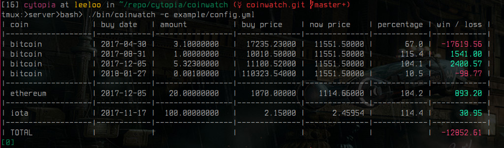

# coinwatch

Coinwatch is a low-dependency python[23] client to keep track of your crypto trades and easily let's you see if you are winning or losing.


## TL;DR

Normal run with custom config path:


Run inside `watch` and refresh every 10 seconds.


## Usage
```bash
Usage: coinwatch [-vhct]
       coinwatch [--version] [--help] [--config <path>] [--text]

coinwatch is a low-dependency python[23] client to keep track of your crypto trades
and easily lets you see if you are winning or losing.

OPTIONS:
    -v, --version  Show version and exit
    -h, --help     Show this help dialog and exit
    -c, --config   Specify path of an alternative configuration file.
    -t, --text     Do not display colors. Text mode is designed to use the
                   output of this program as input for other programs. Such as:
                   $ watch --interval=10 'coinwatch -t'

NOTE:
    No financial aid, support or any other recommendation is provided.
    Trade at your own risk! And only invest what you can effort to lose.

API:
    Currently supported remote price and coin APIs are:
      - coinmarketcap

CONFIGURATION:
    When starting coinwatch for the first time a base configuration file will be
    created in ~/.config/coinwatch/config.yml.
    You should edit this file and add your trades:
      - What currency
      - When bought
      - How much bought
      - Price for 1 coin of currency at that date
```


## API

Currently supported API's are:
  - coinmarketcap


## License

[MIT License](LICENSE.md)

Copyright (c) 2018 [cytopia](https://github.com/cytopia)
